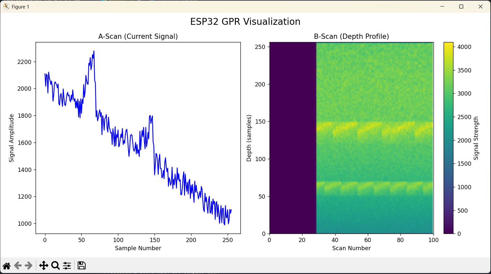

# ESP32 Ground Penetrating Radar (GPR) Visualization

A Python-based visualization tool for real-time Ground Penetrating Radar data from an ESP32 microcontroller. This project provides both A-scan (single signal) and B-scan (depth profile) visualizations of GPR data.



## Features

- Real-time visualization of GPR data
- Dual display mode:
  - A-scan: Shows current signal amplitude
  - B-scan: Displays 2D depth profile over time
- Signal processing capabilities:
  - Noise reduction using moving average filter
  - Time-varying gain compensation
  - Automatic scaling and colormap visualization
- Serial communication with ESP32 hardware
- User-friendly interface with matplotlib

## How It Works

### System Overview
The GPR system consists of two main components:
1. **Hardware Layer**: ESP32 microcontroller with GPR sensors (transmitter and receiver)
2. **Software Layer**: Python visualization program

### Data Flow
1. **Data Collection**
   - The ESP32 transmits electromagnetic pulses into the ground
   - Reflected signals are captured by the receiver
   - Raw data is sent via serial communication in the format:
     ```
     BEGIN_GPR_DATA
     [number_of_scans],[samples_per_scan]
     [sample_1],[sample_2],...[sample_n]
     END_GPR_DATA
     ```

2. **Signal Processing**
   - **Noise Reduction**: A moving average filter smooths the signal
   - **Gain Control**: Time-varying gain compensation enhances deeper reflections
   - **Normalization**: Signals are scaled to the 12-bit ADC range (0-4095)

3. **Visualization**
   - **A-Scan Display**: 
     - Shows real-time signal amplitude vs. depth
     - Useful for analyzing individual reflections
   - **B-Scan Display**:
     - Creates a 2D depth profile over multiple scans
     - Color intensity represents signal strength
     - Helps identify subsurface structures and layers

### Signal Processing Details
```python
# Example of the signal processing workflow
1. Raw Signal → Moving Average Filter (kernel_size=3)
2. Filtered Signal → Time-Varying Gain (depth-dependent amplification)
3. Gain-Corrected Signal → Clipping (0-4095 range)
```

### Performance
- Maximum buffer size: 100 scans
- Real-time visualization at 115200 baud rate
- Supports variable sample depths per scan

## Prerequisites

- Python 3.6 or higher
- ESP32 hardware setup with GPR sensors
- USB connection to ESP32

## Installation

1. Clone this repository:
```bash
git clone https://github.com/itsfuad/Radar.git
cd Radar
```

2. Install required Python packages:
```bash
pip install -r requirements.txt
```

## Usage

1. Connect your ESP32 GPR hardware to your computer via USB.

2. Run the visualization program:
```bash
python map.py --port YOUR_PORT
```
Replace `YOUR_PORT` with your ESP32's serial port (e.g., `COM3` on Windows or `/dev/ttyUSB0` on Linux).

3. The visualization window will open showing:
   - Left panel: Real-time A-scan of current signals
   - Right panel: B-scan depth profile with color-coded signal strength

## Project Structure

```
├── map.py              # Main visualization script
├── requirements.txt    # Python dependencies
├── Rec/               # Receiver related files
├── Trans/             # Transmitter related files
└── Screenshot.png     # Visualization screenshot
```

## Future Enhancements

- [ ] Add data recording and playback functionality
- [ ] Implement more advanced signal processing algorithms
- [ ] Add support for different GPR hardware configurations
- [ ] Include 3D visualization capabilities
- [ ] Add data export features for post-processing
- [ ] Implement automatic port detection
- [ ] Add configuration file support

## Contributing

Contributions are welcome! Please feel free to submit a Pull Request.

## License

This project is licensed under the Mozilla Public License - see the [LICENSE](LICENSE) file for details.

## Author

- [@itsfuad](https://github.com/itsfuad)

## Acknowledgments

- Thanks to the pySerial, NumPy, and Matplotlib teams for their excellent libraries
- ESP32 community for their hardware support
